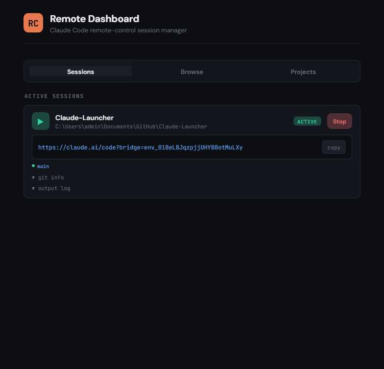
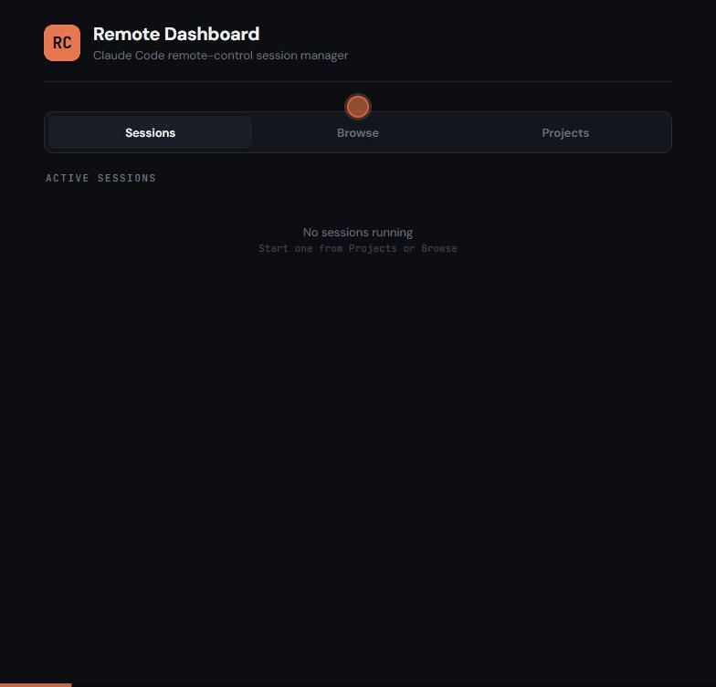
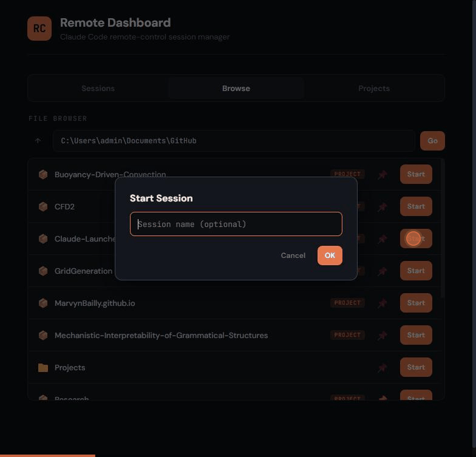
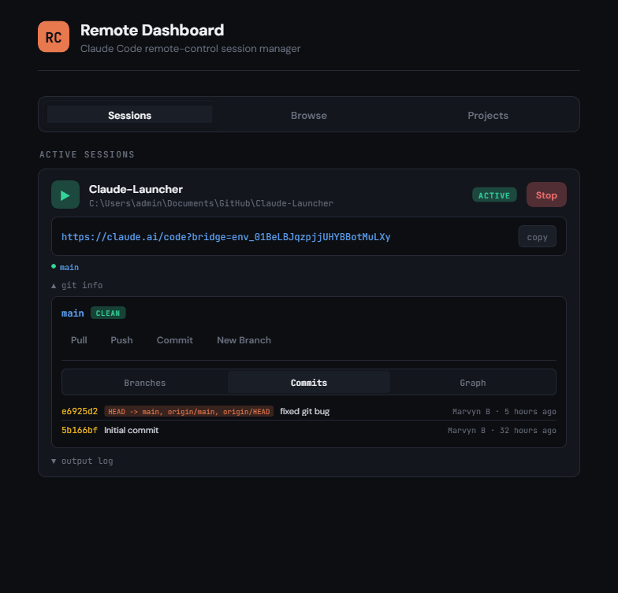

# Claude Launcher

A lightweight, single-file web dashboard for managing [Claude Code](https://docs.anthropic.com/en/docs/claude-code) `remote-control` sessions from any device. Run it on your always-on desktop, access it from your phone or laptop over Tailscale or LAN.



## How It Works

```
+-------------+     Tailscale/LAN     +-------------------+     Anthropic API     +---------------+
|  Your Phone |  ------------------>  |  Desktop (this)   |  <-----------------   |  Claude Code  |
|  or Laptop  |    :7878 dashboard    |  app.py + claude  |    remote-control     |  Session      |
+-------------+                       +-------------------+                       +---------------+
       |                                                                                 |
       +--- opens claude.ai/code URL -----------------------------------------------+
```

1. Open the dashboard from your phone (via Tailscale IP or LAN)
2. Browse your filesystem and pick a project directory
3. Hit **Start** -- the dashboard spawns `claude remote-control` on the desktop
4. Tap the session URL to open Claude Code remotely

### Browse Projects

Navigate your filesystem with automatic project detection. Directories containing `.git`, `package.json`, `pyproject.toml`, etc. are tagged as projects.



### Start a Session

Click Start on any directory to launch a `claude remote-control` session. The dashboard shows the session status, the remote URL, and a one-click copy button.



### Built-in Git Panel

Each session includes a full git panel with branch management, commit history, and graph view. Pull, push, commit, and create branches without leaving the dashboard.



## Quick Start

```bash
git clone https://github.com/MarvynBailly/Claude-Launcher.git
cd Claude-Launcher
pip install -r requirements.txt
python app.py
```

Open `http://localhost:7878` in your browser. That's it.

## Features

- **Session management** -- Start, stop, and monitor Claude Code remote-control sessions
- **File browser** -- Navigate your filesystem with auto-detection of projects
- **Pinned projects** -- Save favorite directories for one-tap access
- **Git integration** -- Branches, commits, graph, pull, push, commit, and new branches
- **Authentication** -- Optional API key auth with a built-in login screen
- **Mobile-first** -- Designed for phone use with proper touch targets
- **Single file** -- One Python file with an embedded frontend. No build step.
- **Cross-platform** -- Windows, macOS, and Linux

## Configuration

Copy the example config and edit it:

```bash
cp config.example.json config.json
```

| Key | Default | Description |
|-----|---------|-------------|
| `host` | `127.0.0.1` | Bind address. Set to `0.0.0.0` for LAN/Tailscale access. |
| `port` | `7878` | Port number. |
| `api_key` | `""` | API key for authentication. **Strongly recommended** when exposing on a network. |
| `permission_mode` | `"default"` | Claude Code permission mode. Options: `default`, `plan`, `autoApprove`, `bypassPermissions`. |
| `auto_trust_directories` | `false` | Auto-accept Claude's trust dialog for session directories. |
| `pinned_dirs` | `[]` | Pre-configured project directories for quick access. |
| `browse_root` | `"~"` | Root directory for the file browser. |
| `claude_binary` | `"claude"` | Path to the `claude` CLI binary. |
| `git_binary` | `"git"` | Path to the `git` binary. |
| `git_log_count` | `20` | Number of commits shown in the git panel. |
| `git_show_remote_branches` | `true` | Show remote branches in the git panel. |
| `cors_origins` | `[]` | Allowed CORS origins. |

## Security

This dashboard can start Claude Code sessions and execute git operations on your machine.

- **Authentication**: Set `api_key` in `config.json` to require a Bearer token on all API requests. If `api_key` is empty and `host` is `0.0.0.0`, a security warning is printed on startup.
- **Network**: Default bind is `127.0.0.1` (localhost only). Use [Tailscale](https://tailscale.com/) for encrypted remote access.
- **Directory scoping**: All operations are restricted to `browse_root` + pinned directories.
- **Permission modes**: Control what Claude Code can do -- from default prompting to full auto-approve.
- **Auto-trust**: Disabled by default. Writes to `~/.claude.json` when enabled.

## Running as a Service

### systemd (Linux)

```bash
sudo tee /etc/systemd/system/claude-dashboard.service << 'EOF'
[Unit]
Description=Claude Remote Dashboard
After=network.target

[Service]
Type=simple
User=YOUR_USERNAME
WorkingDirectory=/path/to/Claude-Launcher
ExecStart=/usr/bin/python3 /path/to/Claude-Launcher/app.py
Restart=always
RestartSec=5

[Install]
WantedBy=multi-user.target
EOF

sudo systemctl enable claude-dashboard
sudo systemctl start claude-dashboard
```

## Requirements

- Python 3.10+
- [Claude Code CLI](https://docs.anthropic.com/en/docs/claude-code) installed and authenticated
- Dependencies: `fastapi`, `uvicorn`, `pydantic` (see `requirements.txt`)

## License

MIT
